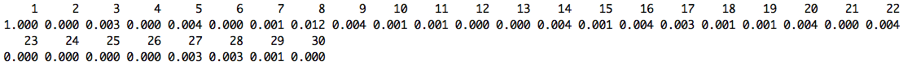

# BMAcausal

This brief vignette is intended to supplement the book chapter titled "Bayesian Model Averaging in Causal Inference" by Joseph Antonelli and Francesca Dominici.  This chapter is a part of a larger textbook on Bayesian model averaging titled "Handbook of Bayesian Variable Selection". Specifically, this repository contains code and data to replicate all of the analyses performed in this chapter. This tutorial will walk users through each step of the code and discuss any subjective decisions that are made in the analysis. We will first walk through an analysis of simulated data and then discuss an analysis of NHANES data, which can be found in the NHANESdata folder of this repository. 

### Loading in the required packages

The analyses considered in these examples are focused on the Bayesian adjustment for confounding (BAC) prior distribution, which has been implemented in a package called BAC that can be downloaded in R using the following lines of code:

```
library(devtools)
install_github(repo = "gpapadog/BAC")
library(BAC)
```

Text



### Simulated example

### Analysis of NHANES data
