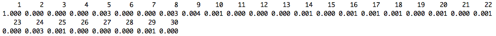
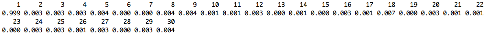
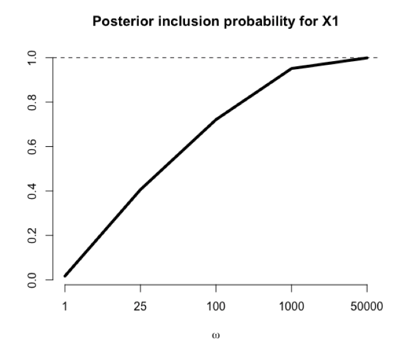
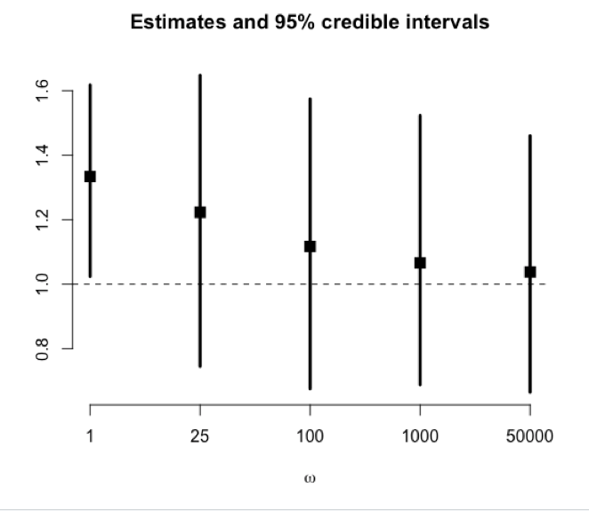

# BMAcausal

This brief vignette is intended to supplement the book chapter titled "Bayesian Model Averaging in Causal Inference" by Joseph Antonelli and Francesca Dominici.  This chapter is a part of a larger textbook on Bayesian model averaging titled "Handbook of Bayesian Variable Selection". Specifically, this repository contains code and data to replicate all of the analyses performed in this chapter. This tutorial will walk users through each step of the code and discuss any subjective decisions that are made in the analysis. We will first walk through an analysis of simulated data and then discuss an analysis of NHANES data, which can be found in the NHANESdata folder of this repository. 

### Loading in the required packages

The analyses considered in these examples are focused on the Bayesian adjustment for confounding (BAC) prior distribution, which has been implemented in an R package called BAC that can be downloaded using the following lines of code:

```
library(devtools)
install_github(repo = "gpapadog/BAC")
library(BAC)
```

### Simulated example

Before moving on to the NHANES analysis seen in the chapter, let's illustrate the code on a simple, simulated example. First, let's generate data where x is our covariate matrix, t is our treatment variable, and y is our outcome to be analyzed. 

```
## Data dimensions
n = 200
p = 30

## Outcome model coefficient for first covariate
beta1 = 0.3

## Generate the data

## covariate matrix
x = matrix(rnorm(n*p), n, p)

## treatment variable
t = rbinom(n, 1, p=pnorm(0.8*x[,1]))

## outcome variable
y = t + beta1*x[,1] + rnorm(n)
```

Note that our sample size is 200 and we have 30 independent covariates. The first covariate is associated with both the treatment and outcome, but is only weakly associated with the outcome. The main goal of the BAC prior is to give higher prior probability (in the outcome model) to covariates with a strong association with the treatment variable. The first covariate is strongly associated with the treatment here, but only weakly associated with the outcome, and we will see how the different prior specfications affect the posterior inclusion probability for this covariate. First, let's run the BAC model for a range of omega values:

```
## Range of omega values to consider
omegaVec = c(1, 25, 100, 1000, 50000)

## Store the BAC models as a list
mod = list()

## Run BAC for each value of omega
## The BAC function uses X for the treatment and D for covariates
## Also note I'm only running 2000 MCMC scans and 2 chains, but
## this should likely be increased for a final analysis
for (oo in 1 : length(omegaVec)) {
  mod[[oo]] = BAC(X = t, Y = y, D = x, Nsims = 2000, chains = 2, omega=omegaVec[oo])
}
```

Of most interest to us are the outcome model posterior inclusion probabilities, but let's first look at the posterior inclusion probabilities from the treatment model. First for omega=1:

```
## Treatment model posterior inclusion probability with omega=1
round(apply(mod[[1]]$alphas[1,,keep,], 3, mean), digits=3)
```


and now for omega=50000

```
## Treatment model posterior inclusion probability with omega=50000
round(apply(mod[[5]]$alphas[1,,keep,], 3, mean), digits=3)
```


We see that the posterior inclusion probabilities are correctly low for all covariates except the first one, which is included in the models 100% of the time under either omega value. Now let's look at the posterior inclusion probabilities in the outcome model for omega = 1

```
## Outcome model posterior inclusion probability with omega=1
round(apply(mod[[1]]$alphas[2,,keep,], 3, mean), digits=3)
```


and now for omega=50000

```
## Outcome model posterior inclusion probability with omega=50000
round(apply(mod[[5]]$alphas[2,,keep,], 3, mean), digits=3)
```


We see that when omega=1 all of the covariates have very low posterior inclusion probabilities. When omega=50000, however, we highly prioritize covariates that are also associated with treatment, and therefore the posterior inclusion probability for the first covariate is essentially 1. We can see what the posterior inclusion probability of this first covariate is for each value of omega

```
## Posterior inclusion probability of the first covariate across omega values
PIPs = round(unlist(lapply(mod, function(x) return(mean(x$alphas[2,,keep,1])))), digits=3)

## Now let's plot these values
plot(1:5, PIPs, pch=15, cex=1.5, ylim=range(PIPs),
     ylab = "", xlab = expression(omega), axes=FALSE, 
     main = "Posterior inclusion probability for X1", 
     type='l', lwd=4)
axis(1, at=1:5, labels=omegaVec)
axis(2)
abline(h = 1, lty=2)
```



Of course, posterior inclusion probabilities are not the ultimate goal of an analysis such as this. We need them high for the confounders of the effect of T on Y, but ultimately of most interest to us is the actual magnitude of the treatment effect estimates. Let's extract these, and their corresponding 95% credible intervals from the model

```
## Now let's look at estimates and 95% credible intervals for the effect of interest
estimates = round(unlist(lapply(mod, function(x) return(mean(x$coefs[2,,keep,2])))), digits=3)
CIlower = round(unlist(lapply(mod, function(x) return(quantile(x$coefs[2,,keep,2], .025)))), digits=3)
CIupper = round(unlist(lapply(mod, function(x) return(quantile(x$coefs[2,,keep,2], .975)))), digits=3)
```

And then plot the resulting estimates and credible intervals

```
## Now let's plot the effect estimates
plot(1:5, estimates, pch=15, cex=1.5, ylim=range(c(CIlower, CIupper)),
     ylab = "", xlab = expression(omega), axes=FALSE, 
     main = "Estimates and 95% credible intervals")
axis(1, at=1:5, labels=omegaVec)
axis(2)
segments(x0=1:5, x1=1:5, y0=CIlower, y1=CIupper, lwd=3)
abline(h = 1, lty=2)
```




### Analysis of NHANES data

Now let's look at the NHANES data that is analyzed in the book chapter. Again we will focus on the BAC prior distribution and therefore no additional R packages need to be loaded. Let's first read in the data, which can be found in this Github repository under the NHANESdata folder. 

```
load("NHANES.Rdata")

dim(C)
dim(X)
dim(Y)

```


